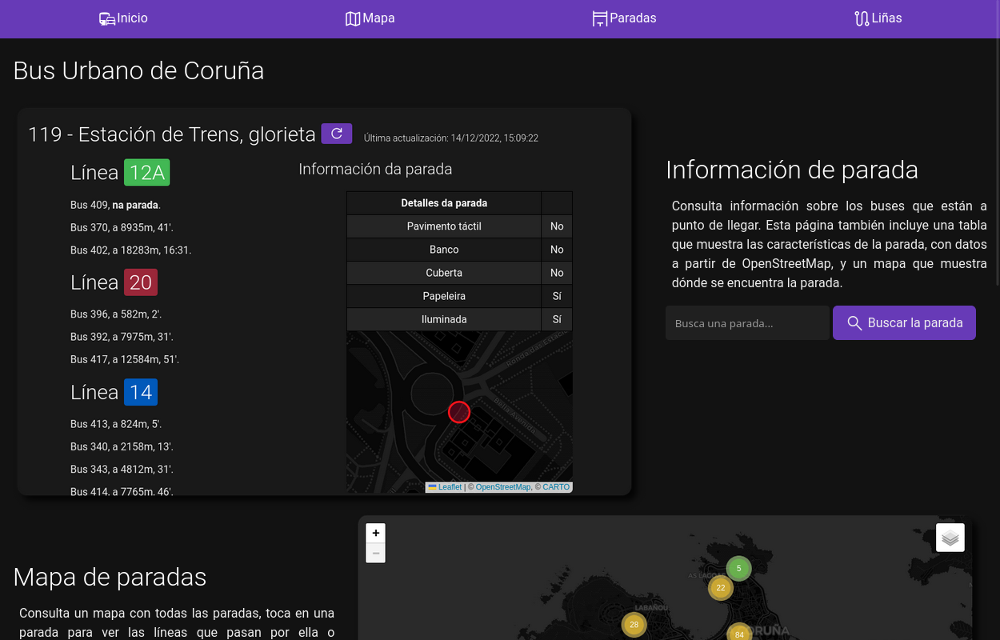

# Bus Coruña - Cliente alternativo

Este proyecto consiste en una página que muestra datos en tiempo real del Bus de Coruña, combinados con información sobre las paradas y mapas con datos de [OpenStreetMap](https://osm.org), un proyecto libre de mapeo.

Es un programa sencillo hecho con flask que descarga los datos desde el servidor de [iTranvías](https://itranvias.com) y los transforma para trabajar con ellos (crear el geoJSON del mapa, por ejemplo), al mismo tiempo que sirve una página en la que se pueden consultar los datos, y una API que la página utiliza para actualizar los datos en tiempo real.

Aunque la página incluye elementos con JavaScript como la búsqueda, los mapas y las actualizaciones en tiempo real, y estos elementos no funcionaran sin JS, sigue siendo posible consultar la información sin ejecutarlos, solo que sin estas funcionalidades.

## PWA: Aplicación Web Progresiva
El sitio se puede instalar como una Aplicación Web Progresiva, por lo que se puede instalar en un teléfono como una aplicación nativa, almacenando en la caché algunos recursos, como los scripts y los estilos.

Este es mi primer proyecto "funcional". Consiste en un cliente alternativo para consultar información sobre el bus urbano de coruña. Además de contener la información en tiempo real que contiene el cliente "oficial", contiene otras funcionalidades, como un mapa con todas las paradas. Por ahora es un trabajo en progreso, por lo que no están implementadas todas las funciones mínimas completamente.
