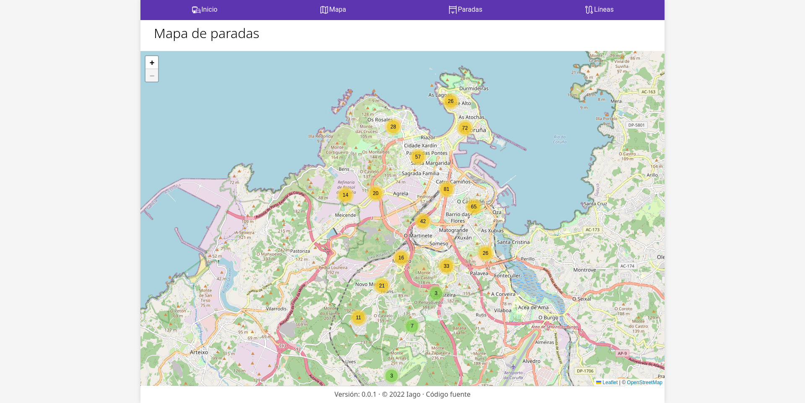

# Bus Coruña - Cliente alternativo

Este es mi primer proyecto "funcional". Consiste en un cliente alternativo para consultar información sobre el bus urbano de coruña. Además de contener la información en tiempo real que contiene el cliente "oficial", contiene otras funcionalidades, como un mapa con todas las paradas. Por ahora es un trabajo en progreso, por lo que no están implementadas todas las funciones mínimas completamente.

El objetivo del proyecto es aprender a obtener datos en formato json de una api, y manipularlos con python, y a hacer una aplicación que contenga datos dinámicos.

## Planes de futuro
Esta sección contiene las ideas que tengo para seguir con el proyecto, organizadas según su plausibilidad.
### Factibles/Relativamente sencillas de implementar
- ~Actualizar los datos sin recargar la página~ Implementado
- ~API con los datos~ Implementado
### Factibles a largo plazo
- ~Mostrar información de las paradas (accesibilidad, características) a través de la API de [OpenStreetmap](https://osm.org) ([Overpass](https://overpass-api.de)).~ Implementado
- Mostrar información meteorológica desde la [API de AEMET](https://opendata.aemet.es)
### Ideas poco factibles
- Corregir la información de los tiempos provista por iTranvías a partir de la distancia
### A lo mejor...
- Incluir datos del bus interurbano a partir de [bus.gal](https://bus.gal)