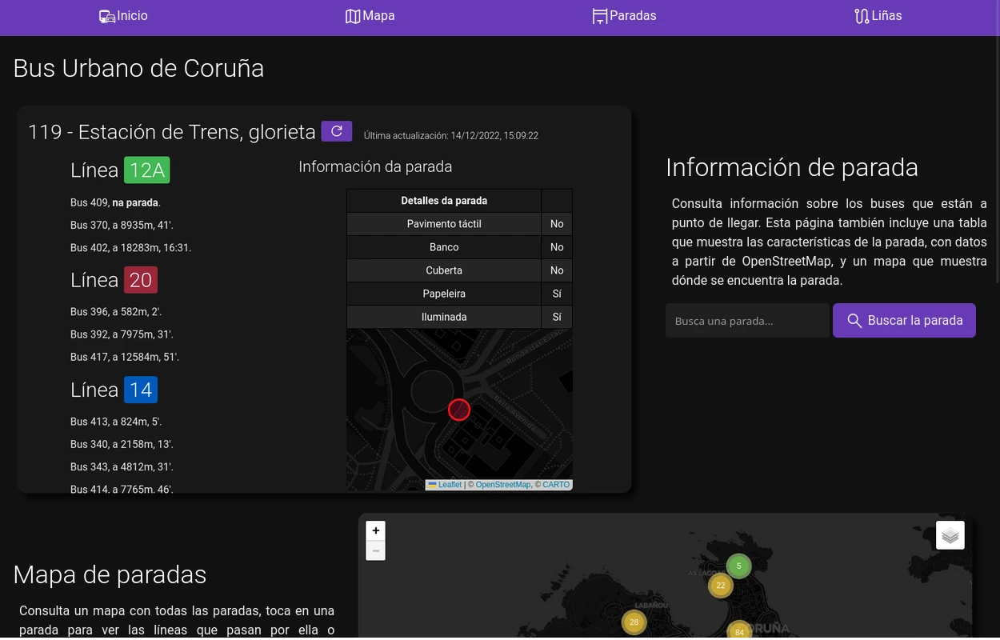
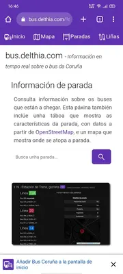
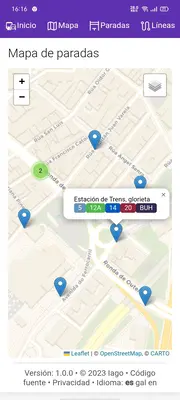
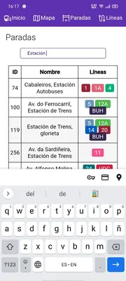
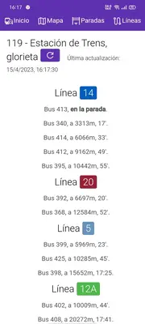
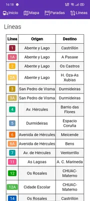
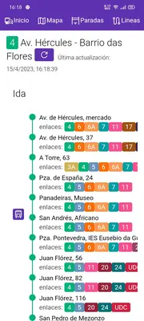

# Bus Coruña - Cliente alternativo

Este proyecto consiste en una página que muestra datos en tiempo real del [Bus de Coruña](https://itranvias.com), combinados con información sobre las paradas y mapas con datos de [OpenStreetMap](https://osm.org).

Es una página hecha con [flask](https://flask.palletsprojects.com) que descarga los datos del servidor de [iTranvías](https://itranvias.com), los transforma para trabajar con ellos, y sirve una página en la que se pueden consultar los datos en tiempo real, actualizados a través de una API generada por el mismo servidor.

Aunque incluye elementos con JavaScript, como los mapas o la habilidad de actualizar los datos en tiempo real, es posible consultar las paradas y sus datos sin javascript.

## PWA: Aplicación Web Progresiva

La página se puede como una Aplicación Web Progresiva, por lo que se puede instalar en un télefono como una aplicación nativa, almacenando algunos recursos y creando un lanzador con atajos.

Se puede instalar desde cualquier navegador web, aunque en Android las pwa están mejor integradas con Chrome, ya que cosas como los atajos del lanzador, no funcionarán en Firefox.

## Origen de los datos
Esta página contiene datos públicos de varias fuentes. La mayoría de los datos provienen de la página de la Compañía de Tranvías de Coruña [itranvias.com](https://itranvias.com), de donde se obtiene una lista de paradas, líneas y relaciones entre estas. A partir de estos datos, se transforman en un JSON que los relaciona entre sí y los une con la información geográfica de [OpenStreetMap](https://osm.org), de donde se obtienen las características de la parada y una ubicación más precisa con respecto al mapa que se utiliza.

Los datos en tiempo real que se sirven en la API también se obtienen de [itranvias.com](https://itranvias.com).

Aunque los datos se modifican para relacionarlos con la información de OpenStreetMap, o se transforma su estructura para simplificarlos o que sea más fácil trabajar con ellos y servirlos. En ningún caso se sobreescribe información como los horarios, las líneas de una parada, u información de otro tipo

## Licencia
Este repositorio está bajo la licencia [AGPL-v3](https://www.gnu.org/licenses/agpl-3.0.html), de modo que es software libre.

En resumen, esto quiere decir que el código es libre. Cualquiera puede estudiarlo, modificarlo o simplemente usarlo, siempre y cuando, ya que es un software de servidor, se incluya algún tipo de enlace a la versión del programa que se ejecuta en el servidor, para asegurar que cualquiera que utilice este programa o una variación del mismo, en cualquier servidor, tenga acceso al código de la versión que está utilizando, asegurándose de que el código permanece libre.

Aunque no es necesaria la atribución para utilizar este código, siempre será bienvenida.
